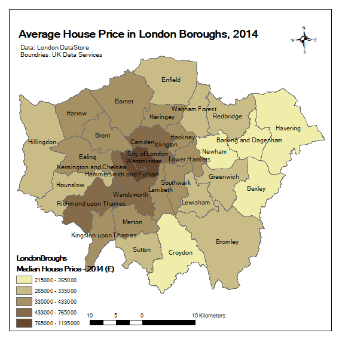

words account: 592

The primitive tools used in the field of geographic mapping are mainly divided into two categories: the GUI-based software and code-based software (Strupler and Wilkinson, 2017). Both kinds of software can output exquisite maps through their effective algorithm and powerful cartographic ability. However, in some cases, due to the different characteristics of each software, some of them may perform relatively better effects. Therefore, based on these two maps the benefits and drawbacks of GUI vs Command line software will be mainly discussed in this essay.

<font size = 6>Maps</font>  
The theme of these two maps is about the average house price in London boroughs and the titles of them are clearly showed on the top of each. Both maps clearly present the distribution of average house price. The area around Kensington and Chelsea got the highest average house price while the price falls as distance increases. The information they present seems quite simple, but it is clear enough for readers to get a basic idea about how house prices are distributed among each London borough. Both maps divide the data into five classes, which is an appropriate number that can not only distinct the different categories but also keep the integrity of the map. 

Though these two maps show us with similar information, there are still some differences between manifestations they express the information. The map produced by Arcgis contains more map elements, such as compass, scale and labels on each area. Through these elements, readers can get a better understanding of the geographic information compared to the other one. The map produced by R adds a base map under price layer. However, this information is too obscure that may have little help. However, with the red color it used, readers can feel much more visual impact and then form a deeper impression than the brown one.

Except for map products, the benefits and drawbacks between two cartographic software themselves determine the quality of the map and the efficiency of the task. According to the practice during the course, they can be summarized as follow

<font size = 6>GUI-based software:</font> Suitable for beginner and simple mapping task.  
GUI-based software can usually provide a better experience. It offers users with graphical interface which means users can easily find the tools they want or move objects freely on the layers. Another advantage is that GUI-based software can input and output almost all format of data (e.g. shp & xml) effectively, which is quite complex in code-based software.

Although most GUI-based software provides loads of functions or tools for their user, they sometimes cannot meet the expectation. Since the functions are all sealed and invisible, users sometimes must carry out lots of operations in correct order to finish a large project. In that case, the whole task can be time-consuming.

<font size = 6>Code-based software:</font> Suitable for professional and complex task  
Code-based software features higher efficiency when same operations are carried out. Unlike GUI-based software, user can directly input order to computer rather than through GUI-based software (Memon and Xie, 2005). Another benefit is users can define their own functions flexibly. Complicated processes which take up a lot of time with GUI-based software can be accelerated with a single command line.

Its main problem is that the function is usually not intuitive enough. Most functions related to mapping and plotting need to be installed and called by users themselves. Therefore, although it executes commands very quickly, it seems not to be a prime choice for most mapping tasks, since users (especially beginners) need to spend a lot of time reviewing documentations and fixing bugs. 

```{r message=TRUE}
library(tidyverse)
library(geojsonio)
library(sf)
library(tmap)
library(tmaptools)
library(ggmap)
library(rgdal)
library(rgeos)
library(ggplot2)
library(sp)
LondonData <- read_csv("https://files.datapress.com/london/dataset/ward-profiles-and-atlas/2015-09-24T14:21:24/ward-profiles-excel-version.csv", na = "n/a")
LondonData <- data.frame(LondonData)
LondonBoroughs <- LondonData[grep("^E09",LondonData[,3]),]
LondonBoroughs <- LondonBoroughs[2:34,]
names(LondonBoroughs)[1] <- c("Borough Name")
EW <- geojson_read("http://geoportal.statistics.gov.uk/datasets/8edafbe3276d4b56aec60991cbddda50_2.geojson", what = "sp")
LondonMap <- EW[grep("^E09",EW@data$lad15cd),]
BoroughMapSF <- read_shape("england_lad_2011.shp", as.sf = TRUE)
BoroughMapSP <- LondonMap
BoroughMapSP <- as(BoroughMapSF, "Spatial")
BoroughMapSP@data <- data.frame(BoroughMapSP@data,LondonData[match(BoroughMapSP@data[,"code"],LondonData[,"New.code"]),])
BoroughDataMap <- append_data(BoroughMapSF,LondonData, key.shp = "code", key.data = "New.code", ignore.duplicates = TRUE)
ggplot()+geom_sf(mapping = aes(geometry=geometry),data = BoroughDataMap)+theme_minimal()
ggplot()+geom_sf(mapping = aes(geometry=geometry, fill=Median.House.Price...U.00A3.....2014),data = BoroughDataMap)+theme_minimal()
palette1<-scale_fill_continuous(low="white", high="red", "Price(£)")
labels<-labs(list(title="Average House Price 2014",x="Longitude", y="Latitude"))
ggplot()+geom_sf(mapping = aes(geometry=geometry, fill=Median.House.Price...U.00A3.....2014),data = BoroughDataMap)+theme_minimal()+palette1+labels
BoroughMapSFWGS84 <- st_transform(BoroughMapSF, 4326)
BoroughDataMap <- append_data(BoroughMapSFWGS84,LondonData, key.shp = "code", key.data = "New.code", ignore.duplicates = TRUE)
londonbbox1 <- c(left = -0.5103766, bottom = 51.28676, right = 0.3340146, top = 51.69187)
londonbbox2 <- as.vector(st_bbox(BoroughMapSFWGS84))
map <- get_stamenmap(londonbbox2, zoom = 10, maptype = "toner-lite")
ggmap(map) + geom_sf(mapping = aes(geometry=geometry, fill=Median.House.Price...U.00A3.....2014),data = BoroughDataMap, inherit.aes = FALSE,alpha=0.7)+theme_minimal()+palette1+labels
```


<font size = 6>References:</font>  
Memon, A.M. and Xie, Q. (2005). *Studying the fault-detection effectiveness of GUI test cases for rapidly evolving software*. IEEE transactions on software engineering, 31(10), pp.884-896.

Strupler, N. and Wilkinson, T (2015). *Reproducibility in the Field: Transparency, Version Control and Collaboration on the Project Panormos Survey*. Open Archaeology, 3(1), pp. 279-304.
